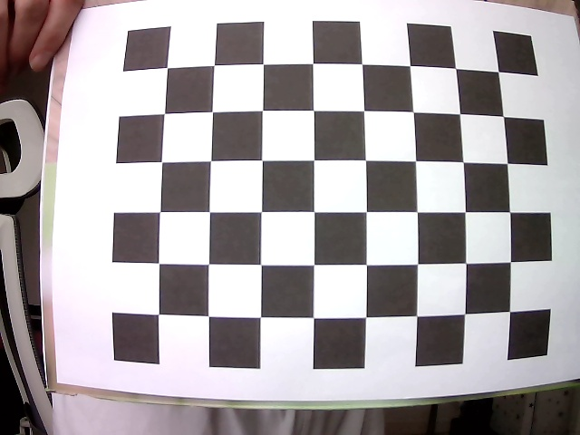
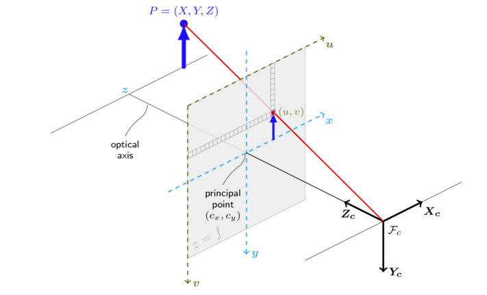

This documentation is about how to calibrate stereo camera and measure the distance of detected human faces.

# Software dependency

#### Qt 5.15
There are different ways to install Qt library. You can follow [Install Qt 5 on Ubuntu](https://wiki.qt.io/Install_Qt_5_on_Ubuntu) or [Building Qt 5 from Git](https://wiki.qt.io/Building_Qt_5_from_Git#Getting_the_source_code)

#### TensorFlow Lite 2.1
Clone [tensorflow](https://github.com/tensorflow/tensorflow) and checkout version 2.1.
```sh
git clone https://github.com/tensorflow/tensorflow.git
cd tensorflow
git checkout r2.1
```

Download dependencies of tensorflow lite and build the static library
```sh
cd tensorflow/lite/tools/make
./download_dependencies.sh
./build_lib.sh
```
The library files are generated in directory "/gen/linux_x86_64/lib".

#### OpenCV 4.x
Follow [Installation OpenCV](https://docs.opencv.org/3.4/d7/d9f/tutorial_linux_install.html) to install OpenCV. It is recommended to install [OpenCV contrib](https://wiki.qt.io/Building_Qt_5_from_Git#Getting_the_source_code) as well. 
To compile OpenCV you can use the following commands for debug and release version.
```sh
cmake -DOPENCV_ENABLE_NONFREE:BOOL=ON CMAKE_BUILD_TYPE=Debug -DCMAKE_INSTALL_PREFIX=/usr/local -DWITH_V4L=ON -DWITH_QT=ON -DWITH_GTK=ON -DWITH_OPENGL=ON -DOPENCV_EXTRA_MODULES_PATH=../../opencv_contrib/modules ..
cmake -DOPENCV_ENABLE_NONFREE:BOOL=ON CMAKE_BUILD_TYPE=Release -DCMAKE_INSTALL_PREFIX=/usr/local -DWITH_V4L=ON -DWITH_QT=ON -DWITH_GTK=ON -DWITH_OPENGL=ON -DOPENCV_EXTRA_MODULES_PATH=../../opencv_contrib/modules ..
```
The enviroment variable "OpenCV_DIR" should be set to path of OpenCV library e.g. "/home/opencv/build_Release/".

#### CMake 3.8+
Follow [Installing CMake](https://cmake.org/install/) to install OpenCV.

# Quick start
Local compile and build project:
```sh
mkdir build
cd build
cmake -DARCH=PC -DTENSORFLOW_DIR=<path of tensorflow repository>  ..
make
```
The binaries "takephoto", "calibration" and "StereoVision" will be then generated in directory "build". Before run on PC, please check if the two camera paths are set correctly in gstreamer pipeline.

Cross compile:
Downloade and install [SDK file](https://spaces.hightail.com/space/mJuKLQU8BQ/files), then source enviroment file
```sh
. /opt/strudel/0.1/sm2s-imx8mp/environment-setup-cortexa53-crypto-strudel-linux
mkdir buildCross
cd buildCross
cmake ..
make
```

Run "takephoto" to take photos for the calibration. The input is gstreamer pipeline with assumption that the resolution of left and right image are same. E.g.
```sh
./takephoto "compositor name=comp sink_1::xpos=640 sink_1::ypos=0 ! videoconvert ! appsink v4l2src device=/dev/video2 ! video/x-raw,format=YUY2,width=640,height=480 ! videoconvert ! video/x-raw,format=RGB ! comp. v4l2src device=/dev/video0 ! video/x-raw,format=YUY2,width=640,height=480 ! videoconvert ! video/x-raw,format=RGB ! comp."
```
The images will be saved in foler "image" located at the root of project. You can edit the variables defined in file "takephoto.cpp" to change the file name, file extention and so on.
The chess board with size 25mm-8*6 is required, which is save as "Checkerboard-A4-25mm-8x6.pdf". Just print it in format of A4 and glue it to the flat hard board. You can also use your own checkboard. If the size of your board is not identical, you must adjust the corresponding variables in file "calibration.cpp".


Run "calibration" to calculate the data for the camera calibration.
```sh
./calibration
```
The intrinsic and extrinsic parameters of cameras will be saved in files "left.yml", "right.yml" and "stereo.yml" in folder "camera_data" located at the root of project. Note: if you edit the path or name of the images for the calibration, you need to adjust the corresponding variables in file "calibration.cpp".

More details about camera calibration can be seen in [Camera Calibration using OpenCV](https://learnopencv.com/camera-calibration-using-opencv/) and [Camera Calibration OpenCV](https://docs.opencv.org/3.4/dc/dbb/tutorial_py_calibration.html)

Run "StereoVision" to launch the main application. The application loads the extrinsic parameters in file "stereo.yml" at the initial phase. The GUI shows then the undistorted video streams. The gstreamer pipeline should be same as the pipeline of "takephoto".
```sh
./StereoVision
```

# Algorithmus
The process of measuring distance consists of two steps: 1. Human detection. 2. Disparity calculation of the ROI (region of human)
The application detects human face with artificial neural networks and pair the bounding box of faces in stereo images according to their position, size and so on. The distance is computed with disparity of the middle of box.

#### Human detection
There are various implementations for human detection in openCV, such as [Haar-cascade Detection](https://docs.opencv.org/3.4/db/d28/tutorial_cascade_classifier.html), [HOG Detection](https://thedatafrog.com/en/articles/human-detection-video/), and [DNN (Deep Neural Network) method](https://docs.opencv.org/4.x/d2/d58/tutorial_table_of_content_dnn.html). Unfortunately openCV is not supported by the the acceleration provided by the Neural Processing Unit (NPU) integrated on [Avnet i.MX 8M Plus Edge AI Kit](https://www.avnet.com/wps/portal/us/products/avnet-boards/avnet-board-families/avnet-imx-8m-plus-edge-ai-kit/avnet%20i.mx%208m%20plus%20edge%20ai%20kit/!ut/p/z1/tZRra4MwFIZ_S3-A5JhoTD5GJ0anrba1m_kyrNoiW20Zw11-_VzZhV2qg2K-hMBznnNeDgQpdI1Uk7f1Nn-o901-170zRW88bvq640A0W15iSCwemrGDMaMWujoCoeCuFIBD8EMCwo4uGF0GIBKK1H_q4cQRMFS_QpmNsqdSenL7Lvuig7Sj-VR4sSt9xyLDw6gj0hfnOzBzbRsEWawEm9vYJx9AX6AfU_wesheQGGVdTOtkjrTL0dbVI0qb_f2u2-HizXgo6hJl66I0zNxgWqEbumYAA42trUrDLDfphlcm6BRJGOigG2d2GNDTUfVyZL05rt4aVc_HXS0no-pjOFMfDP4Qzudno3R02KVp86zdzt1N5BIjC9oXe6r9ealETCavrVCw8g!!/dz/d5/L2dBISEvZ0FBIS9nQSEh/?urile=wcm%3Apath%3A%2Favnet%2Bcontent%2Blibrary%2Favnethome%2Fproducts%2Favnet-boards%2Fdev%2Bboards%2Bkits%2Bsoms%2Favnet-imx-8m-plus-edge-ai-kit%2Favnet%2Bi.mx%2B8m%2Bplus%2Bedge%2Bai%2Bkit). Instead, [TensorFlow Lite](https://www.tensorflow.org/lite/microcontrollers) with [NNAPI delegate](https://www.tensorflow.org/lite/performance/delegates) will be used, which is originally designed for mobile devices running Android 8.1 (API level 27) or higher but NXP managed to make it available on Linux platforms to interact with the GPU/NPU.

The tflite model files, which is required to run network, locate in "dnnData" folder. You can checkout the lastest models from [MediaPipe](https://google.github.io/mediapipe/solutions/models.html#face_detection). The App support two models: "short range", which is designed for faces within 2 meters from the camera and the "full range", which is designed forr faces within 5 meters from the camera. If you use other models, please adapt the parameters of FaceOptions in code according to the corresponding description file e.g. [face_detection_full_range_common.pbtxt](https://github.com/google/mediapipe/blob/master/mediapipe/modules/face_detection/face_detection_full_range_common.pbtxt) or [Model card](https://google.github.io/mediapipe/solutions/models.html#face_detection).

The article [Understanding Bounding Box Outputs from Neural Networks](https://colab.research.google.com/drive/1dYaiKsS3udII6cqShN1ikOANrlaI7u1u?usp=sharing) explains how to use model and set parameter for face detection. 

According to [i.MX Machine Learning User's Guide](https://www.nxp.com/docs/en/user-guide/IMX-MACHINE-LEARNING-UG.pdf), the NPU on Edge AI Kit only supports integer datatype. To run app on target we must use integer-quantized model instead of the float one aka . There are two forms of quantization: [post-training quantization](https://www.tensorflow.org/model_optimization/guide/quantization/post_training) and [quantization aware training](https://www.tensorflow.org/model_optimization/guide/quantization/training). We use [edge-ai-toolkit](https://github.com/avnet-embedded/edge-ai-toolkit) to generate compatible model with NPU, which is an implementation of "quantization aware training". Please checkout and run the "edge-ai-toolkit" project, then the model "face_detection_short_range_int8.tflite" will be generated (with name "blazeface_int8.tflite"). 

Unfortunately, an interger-quantized model for "full range" is still not available. The "*.ipynb" files in directory "000-face-detection" of [edge-ai-toolkit](https://github.com/avnet-embedded/edge-ai-toolkit) must be modified to adapt neural network of "full range" model.

#### Disparity calculatation
Disparity refers to the distance between two corresponding points in the left and right image of a stereo pair. The disparity of a point in rectified image (camera calibration) can be used to calculate the coordinates of this point in the real world.



After calibration, the two feature points of a pair has theoretically the same v-coordinate in image. In this case the disparity refers to the difference of u-coordinates between two corresponding points in the left and right image. Once disparity is computed, the Z-coordinate in real world can be calculated since the other parameters can be obtained in file "camera_data/stereo.yml".

Each detected face in the left image will be matched with the one in right image. The two face blocks will be considered as matched if their width, height and v-coordinates are same. Once faces are matched, their disparity will be computed to calculate the distance.

# Tuning Parameters
- ConfidenceThresh [0.01, 1.0]: The variable defines the minimum confidence for face detection. Only the detected faces with confidence more than the threshold will be processed.
- FaceOverlapThresh [0.01, 1.0]: To increase the accuracy, the overlapped detected faces will be treated as one. The variable defines the maximum overlap. The two objects with overlap more than the threshold will be treated as one.
- Disparity_Y Thresh [0, 100]: The variable define threshold of the disparity difference in v-direction, which is used for face matching.
- Width\_Rel\_Thresh [0.01, 1.0]: The variable define threshold of reletive deviation of face block width. 0.1 means that the face blocks in left and right frame will not be matched each other if the difference of height more than 10%.
- Height\_Rel\_Thresh [0, 10]: The variable define threshold of reletive deviation of face block height. 0.1 means that the face blocks in left and right frame will not be matched each other if the difference of height more than 10%.
- SkipFrame [0, 20]: To accelerate the calculation, not all the frame will be process. If the variable set to 4, then only one frame will be process in every 4 frames.
